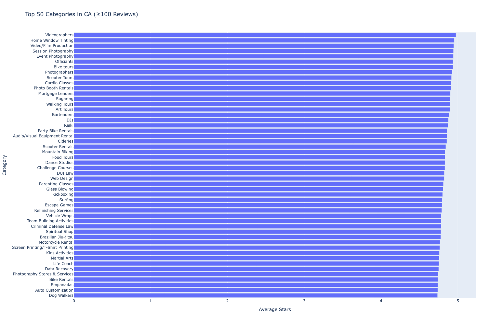
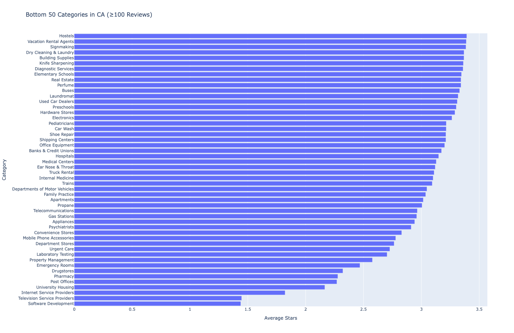

# Yelp Insights

## Attributions

Thanks to Chad Gosselin (https://github.com/cgio) for providing U.S. Census Data via GitHub URL (https://github.com/cgio/global-ethnicities).
This U.S. Census data is used to promote fairness/normalization in our analysis.

Thanks to Yelp for providing the core dataset for insights.

## Statement of Purpose

This project is for academic purposes.

## Data
Download Yelp data from: https://business.yelp.com/data/resources/open-dataset/

## Environment
```
$ conda env create -f environment.yml
$ conda activate yelp-env
```

# Insights

## Top 50 business categories in CA ranked by Average Stars
In California, categories such as tourism (art tours, wine tours), photography (photo booth, event photography), and event planning/rental tend to be rated favorably (above 4.5 on average).

These categories are noticeably active, in-person activities.



## Bottom 50 business categories in CA ranked by Average Stars
In California, categories such as corporate service providers (Internet/TV providers), health-related facilities (hospitals, pharmacy), and housing (real estate, apartments, university housing) tend to be rated unfavorably (below 3.5 on average).

Relative to the Top 50 categories, the bottom 50 generally:
- have a high barrier of entry (e.g. starting capital)
- are required by law or are effectively the only option available
- appear to just generally suck

There are a few exceptions to this, however.


